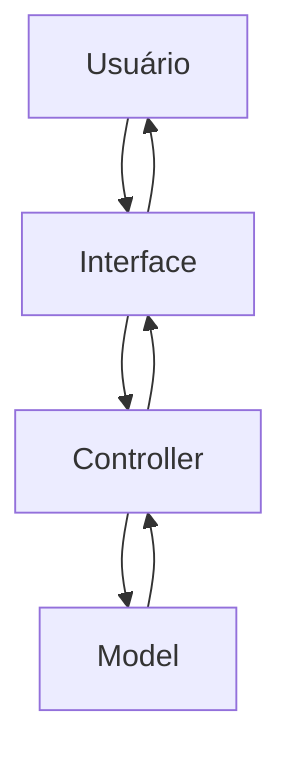
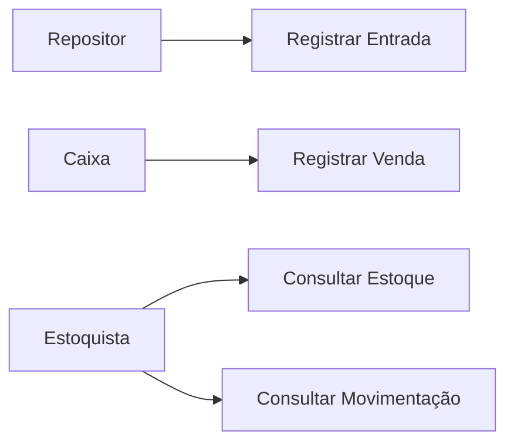
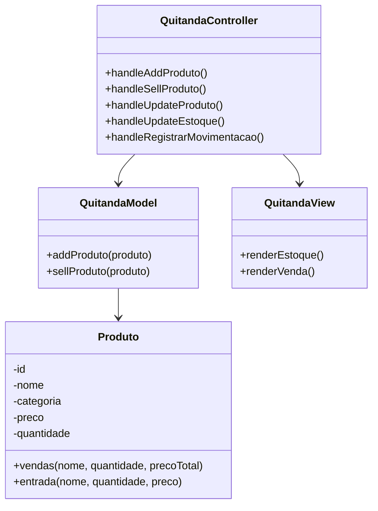
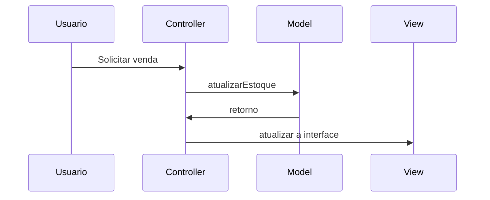

# Documentação de Especificações de Requistos de Software (SRS)

## Sistema de Gestão de Quitanda (Quitanda MVC)

**Padrão Internacional:** ISO/IEC/IEEE 29148:2018
**Versão:** 1.0.0
**Data:** 2026-04-14
**Autor:** DiogoTB

---

## 1. Introdução

### 1.1 Propósito

Este Documento descreve os requisitos do sistema **Quitanda MVC**, com o objetivo de:

* definir funcionalidade
* padrionizar entendimentos entre os stakeholders
* servir como base para desenvolvimento e teste

---

### 1.2 Escopo

O Sistema permitirá:

* registro de entrada de produtos
* controle de estoque
* registro de vendas
* visualização dos histórico da movimentações

O Sistema será uma aplicação web frontend utilizando:

* HTML
* CSS
* JavaScript
* Arquitetura MVC
* Estrutura POO

Objetivos:

---

### 1.3 Definições e Acrônimos

Tabela de Termos e Definições

| Termos | Definições |
| - | - |
| Produto | Item Comercializado na quitanda |
| Entrada | Registro de chegada de produto |
| Saída | Registro de venda de Produto |
| Estoque | Quantidade disponível de produtos |

Lista de Acrônimos

* **SGQ:** Sistema de Gestão de Quitanda
* **RF:** Requisitos Funcionais
* **RNF:** Requisitos Não Funcionais
* **UC:**  Casos de Uso
* **CA:** Critérios de Aceitação

### 1.4 Visão Geral do Documento

Este Documento está Organizado em:

* Introdução e Visão Geral
* descrição do sistema
* requistos detalhados
* modelos UML
* regras de negócio

---

## 2. Descrição Geral do Sistema

### 2.1 Perspectiva do Sistema

O Sistema é standalone (frontend), operando em um navegador web.

---

### 2.2 Funções do Sistema

O Sistema deve:

* Cadastrar produtos
* Atualizar estoque
* Registrar vendas
* Validar Operações
* Exibir dados
  
---

### 2.3 Classes de Usuários

| Usuários | Descrição |
| - | - |
| Estoquista | Gerenciar estoque |
| Caixa | Realizar Venda |
| Repositor | Registrar Entradas |

---

### 2.4 Ambiente Operacional

* Navegadores Web (Chrome, Edge, Firefox, Brave)

---

### 2.5 Restrições

* não utiliza Banco de Dados
* dados aramazenado na memória
* sem autenticação

---

### 2.6 Suposições

* Usuário possui conhecimento de Informática
* Volume de dados é pequeno

---

## 3. Requisitos do Sistema

### 3.1 Requisitos Funcionais

#### RF-01: Cadastro de produtos

**Descrição** Permitir cadastrar um produto
- Prioridade: Alta
- Versão: 1.0
- Data: 2026-04-28
- Rastreabilidade: Necessidade do Stakeholder 01

**Critérios de Aceitação**
[] Entrada de Dados: Nome, Categoria, Preço, Quantidade
[] Validação dos Campos
[] Verificação de Duplicidade
[] Saída: Notificação para o usuário

#### RF-02: Atualizar Estoque

**Descrição** Permitir atualização de dados de itens existentes
- Prioridade: Alta
- Versão: 1.0
- Data: 2026-04-28
- Rastreabilidade: Necessidade do Stakeholder 02

**Critérios de Aceitação**
[] Verificar se item já está cadastrado
[] Entrada de Dados: Nome, Categoria, Preço e Quantidade
[] Verificação de Campos
[] Saída: Notificação para o usuário

#### RF-03: Listagem de Estoque

**Descrição** Exibir informações dos Produtos Cadastrados
- Prioridade: Alta
- Versão: 1.0
- Data: 2026-04-28
- Rastreabilidade: Necessidade do Stakeholder 03

**Critérios de Aceitação**
[] Listagem de Produtos
[] Saída: Id, Nome, Categoria, Preço, Quantidade

#### RF-04: Registro de Vendas

**Descrição** Permitir a venda de produtos
- Prioridade: Alta
- Versão: 1.0
- Data: 2026-04-28
- Rastreabilidade: Necessidade do Stakeholder 04

**Critérios de Aceitação**
[] Venda de Produtos Cadastrados
[] Verificação de Quantidade
Atualização do Estoque
[] Notificação ao Usuário sobre a venda

#### RF-05: Histórico e Movimentações

**Descrição** Permitir o Registro de Movimentações (Entrada e Saída) de Produtos
- Prioridade: Média
- Versão: 1.0
- Data: 2026-04-28
- Rastreabilidade: Necessidade do Stakeholder 05

**Critérios de Aceitação**
[] Resgistro de Movimentações em Lista
[] Consulta das Movimentações
[] Verificação de Duplicidade
[] Notificação ao Usuário

---

### 3.2 Requisitos Não Funcionais

### RNF-001 : Usabilidade
**Descrição** Interface Simples e Intuitiva

### RNF-002 : Desempenho
**Descrição** Respostas rápidas e inferiores a 1 segundo

### RNF-003 : Arquitetura de Software MVC
**Descrição** Estrutura da Arquitetura de códigos em Padrão MVC (Model, View, Controller)

### RNF-004 : Confiabilidade
**Descrição** Validação de entrada de dados obrigatória

---

## Regras do Negócio

Tabela de Regras
|Regras de Negócio|Descrição|
|-|-|
| RN-01 | Quantidade de produtos não pode ser negativa |
| RN-02 | Preço do produto não pode ser negativo |
| RN-03 | Venda só pode ser realiazada se estoque for suficiente |
| RN-04 | Toda movimentação deve ser registrada |

Podem existir Restrições para o Negócio (legais, locais...)

---

## 5. Modelos do Sistema

### 5.1 Diagrama de Casos de Uso

Diagramas de Casos de Uso: O que o sistema deve fazer do ponto de vista do usuário

---

### 5.2 Diagramas de Classes UML

Diagrama de Classes UML: Estrutura do código, classes, atributos e métodos

---

### 5.3 Diagrama de Sequência

Diagrama de Sequência: Interação entre objetos ao longo do tempo, para realizar uma funcionalidade específica

#### 5.3.1 Venda

---

## 6. Análise de Risco

### 6.1 Matriz de Análise de Risco

| Risco | Impacto | Mitigação |
| - | - | - |
| Perda de Dados | Alto | Usar LocalStorage |
| Entrada de Dados | Médio | Validar as Entradas de Dados |

---

## 7. Controle de Versões

### 7.1 Histórico de Alterações

| Versão | Data | Autor | Modificação |
| - | - | - | - |
| 1.0.0 | 2026-04-28 | Lucas Gato | Versão Inicial |

---

### 7.2 Aprovações

| Papel | Nome | Data | Assinatura |
| - | - | - | - |
| Stakeholder | Seu Joaquim | 2026-04-29 | [] |